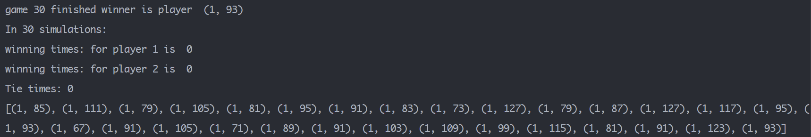
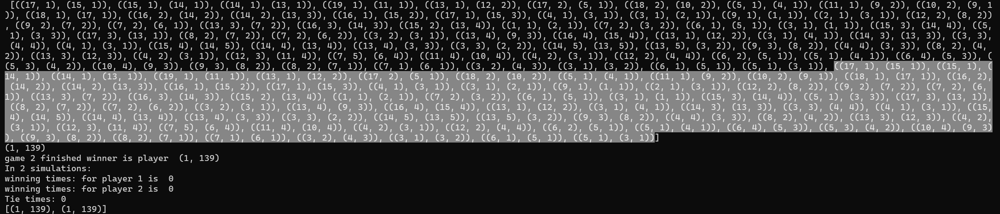
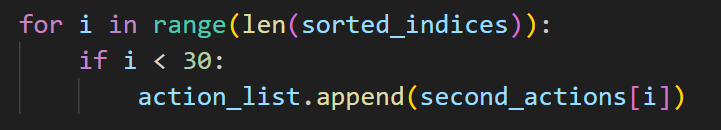

## Report of Homework 2

### 1. Baseline of Algorithm Implementation
We first explain the function "getAction". The input to it is the current state(which player is turned to go and what the current board is). The output should be the optimal action for the current player. 

To do this, we apply the minimax algorithm with alpha-beta pruning. Due to the limit of time, we let the depth of the algorithm be 3, and we design an evaluate function to evaluate the quality of one board state for one player. 

Besides, when considering the list of actions for one state, we forcely reject some "bad" action and sort the remaining actions. We only choose the 30 actions with highest score. The reason for doing this is that if all actions are considered, the time consumption will be very serious. In other word, we sacrificed a portion of the algorithm's accuracy to reduce time consumption.

The design of the evaluate function and some details of the algorithm will be discussed in the following parts.

### 2. Details in the Process of Algorithm Implementation
#### (1) Design of evaluate function for a state
We consider some factors to evalaute the qaulity of the current state for the current player:
##### (a) the distance of cheese pieces to their target position 
For the current player and the chessboard, we calculate a value for each of the player's chess pieces, and the value is larger when the piece is closer to its target position.(If the chess piece is in the target position, this value will be particularly high, which encourages the chess pieces to move to thier target position) We add all the values up as "sum_1". We do the same thing for the opponent player to get "sum_2". sum_1 - sum_2 can be taken to evaluate the quality of the state for the player.

##### (b) the concentration degree of the chess pieces(optional)
Calculate the concentration degree(集中程度) of the player's chess pieces as "res_1". We do the same thing for the opponent player to get "res_2". sum_1 - sum_2 can be taken to evaluate the quality of the state for the player. The more concentrated the chess pieces are, the possibility of Continuous jumping for the player is higher.
    
From the test results, it appears that the concentration degree is not particularly important.

##### (c) the farest distance of the cheese pieces to the target position
Find one player's cheese piece whose distance to its target position is farest among all the pieces. Get the farest distance. The purpose of considering this item is to avoid a chess piece not coming out of the base camp all the time (which will be blocked by the opponent's chess piece and unable to come out), or falling too far behind other chess pieces.

##### (d)weighted sum of different evaluation results
We use a weighted sum of the three score as the final score for the current state.

#### (2) Design of evaluate function for a step
get a score for one action for the current state. Overall, the farther the action move the cheese piece or move the chess piece to the target position, the higher the score for this action.

If the action only move the cheese to its neighbor position, some score will be deducted.

If the action move the specail peice which has been moved to its target position, much score will be deducted.
    

#### (3) Dealing with the problem of action entering a cycle
In testing, we found that if the actions of the chess pieces are not additionally constrained on this basis, the final actions of the chess pieces will enter a loop (a chess piece jumps from pos1 to pos2, and then from pos2 to pos1).

To deal with this problem, we maintain a list to record the historical actions, and change the algorithm for teamAgent to select actions to minimax algorithm with depth=1 as long as looping occurs. From then on, we eliminate actions that are repetitive with the previous 10 actions before implementing this algorithm.

(We change the depth of minimax algorithm from 3 to 1 becuase teamAgent perform better with depth=1 when repetitive actions are denied. The theoretical basis for this phenomenon may be that when a loop occurs, most of the chess pieces are already in target position, and those not in target position are approaching the designated position, so there is no need to consider the opponent's action at this time.)

### 3. Test Results
#### (1) my agent as the first player (Player 1) against the SimpleGreedyAgent

Out of 30 times, teamAgent won 30 times within 200 steps.
In 30 times, teamAgent defeated the opponent with an average of 95.2 steps.

#### (2) my agent as the second player (Player 2) against the SimpleGreedyAgent

Out of 30 times, teamAgent won 29 times within 200 steps, and the remaining 1 time teamAgent moved more cheese pieces to target position than the opponent after 200 steps.
In the 29 "totally winning" times, teamAgent defeated the opponent with an average of 94 steps.

注：上面的图中最下面的列表中的每个元素代表每一局的情况，每个括号里的第一个元素代表赢家编号，第二个元素代表本局结束时的回合数。由于我在test.py中修改了runGame函数的输出为一个元组，所以winning time的结果是0。

#### (3) two TeamAgent instances compete against each other
Due to the absence of randomness, each step in the battle between two teamAgents is deterministic. The following results also confirm this.

We let two teamAgents fight twice, and both times Player_1 won.
And the actions player_1 perform of 2 times is the same.

### 4. Limitation Analysis of My Minimax Algorithm in this Game
**(1)** Because some actions are eliminated before algorithm implementation to reduce time consumption, the consideration of teamAgent is incomplete, resulting in missing the optimal action.

**(2)** The depth(=3) of the minimax algorithm is relatively small, resulting in missing the optimal action.

**(3)** This algorithm performs very poorly in handling the last few steps, and even after making some adjustments to solve the loop situation, there will still be redundant actions in the last few steps.

### 5. Several Key Points to Note during Testing!!!
If you want to test my design of agent.py, you should pay attention to the following points:
##### (1) 
If the maximum number of rounds allowed in the game("iteration" in the code) is changed, the attibute "max_iteration" of class "Agent" should be modified accordingly.

##### (2)
If you find that the decision time for one step is too long, you can modify the maximum number of actions selected at a time in lines 462 and 529 in agent.py.

