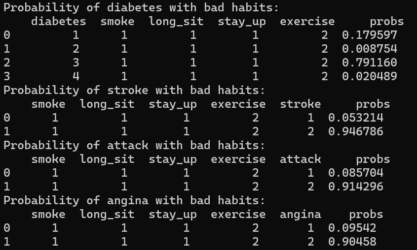
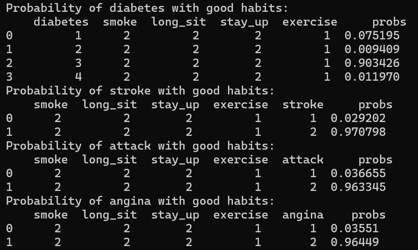
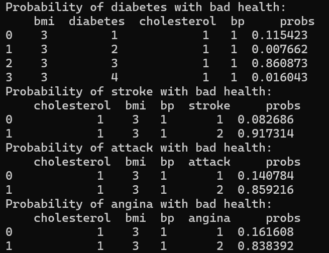
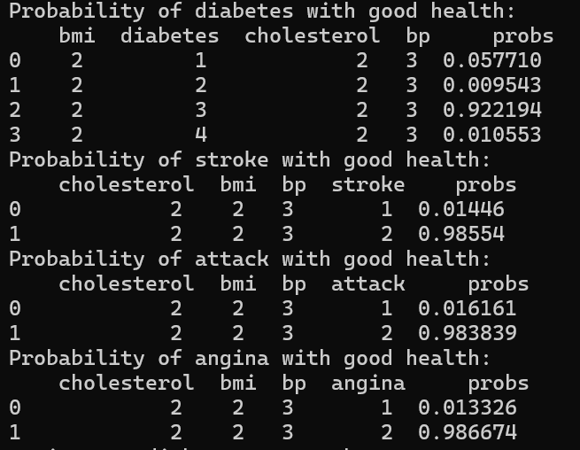
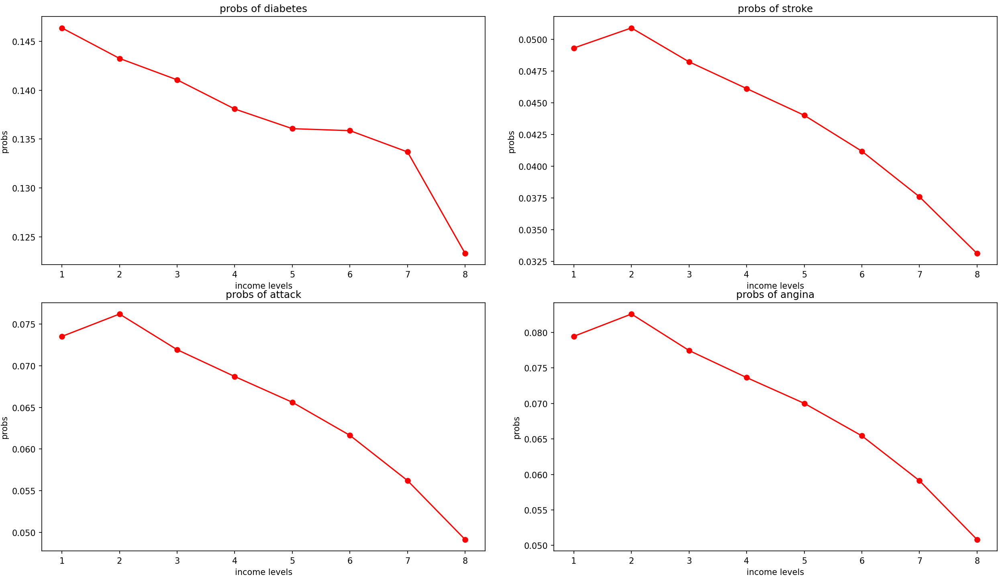
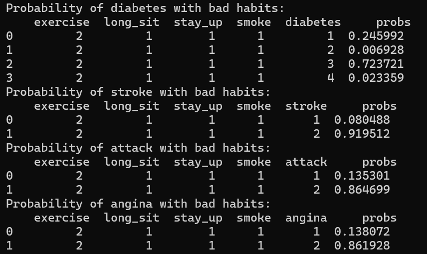
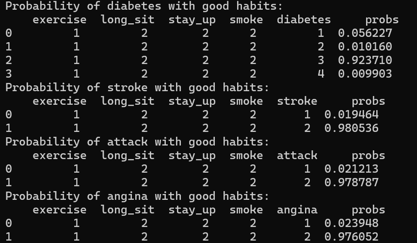
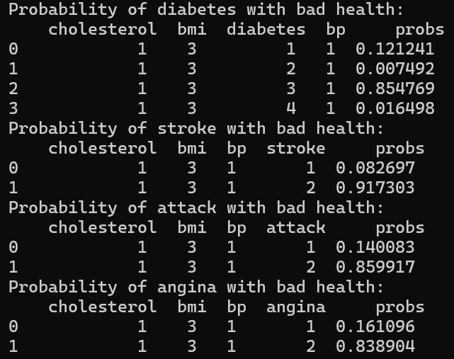
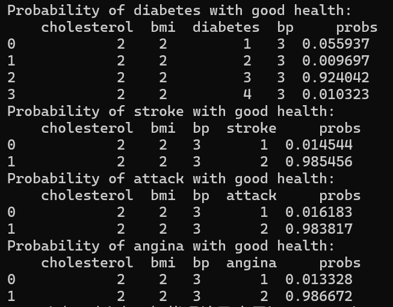
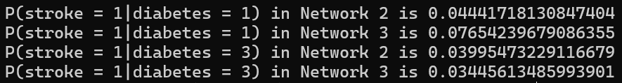

## Report of AI3603_HW4

### 1. Coding Part
In this part, we will interpret the input and output of each function in BayesianNetworks.py, as well as the important steps in them.
#### 1.1 readFactorTable
- **Input**: 
varnames: list of variable names $[X_1,X_2,…,X_n]$, such as ```['gauge', 'battery', 'fuel']```
probs: probability vector of flattened probability table, such as ```[0.8, 0.2, 0.2, 0.1, 0.2, 0.8, 0.8, 0.9]```
outcomesList: a list of result vectors containing each variable, such as ```[[1, 0], [1, 0], [1, 0]]```

- **Output**: the constructed conditional probability table read from the input, representing $P(X_1|X_2,…,X_n)$. The output of the example will be:
```python
   probs  fuel  battery  gauge
0    0.8     1        1      1
1    0.2     0        1      1
2    0.2     1        0      1
3    0.1     0        0      1
4    0.2     1        1      0
5    0.8     0        1      0
6    0.8     1        0      0
7    0.9     0        0      0
```

#### 1.2 readFactorTablefromData
- **Input**: 
data: a pandas DataFrame containing the data.
varnames: a list of variable names

- **Output**:
a pandas DataFrame containing variables and their conditional probabilities

- **Example**
```python
data = pd.DataFrame({
    'A': [1, 1, 2, 2, 1],
    'B': [1, 2, 1, 2, 1],
    'C': [1, 1, 1, 1, 2]
})

varnames = ['A', 'B', 'C']

readFactorTablefromData(data, varnames) = 
   probs  C  B  A
0    0.5  1  1  1
1    1.0  2  1  1
2    0.5  1  2  1
3    0.0  2  2  1
4    0.5  1  1  2
5    0.0  2  1  2
6    0.5  1  2  2
7    0.0  2  2  2
```

#### 1.3 joinFactors
- **Input**
Two factors with dataframe type, such as    
```py
FuelState = 
    probs  fuel
0    0.9     1
1    0.1     0
GaugeBF = 
     probs  fuel  battery  gauge
0    0.8     1        1      1
1    0.2     0        1      1
2    0.2     1        0      1
3    0.1     0        0      1
4    0.2     1        1      0
5    0.8     0        1      0
6    0.8     1        0      0
7    0.9     0        0      0
```

- **Find common variables**
```py
col_1 = [col for col in Factor1_copy.columns if col != 'probs']
col_2 = [col for col in Factor2_copy.columns if col != 'probs']
common_vars = list(set(col_1).intersection(set(col_2)))
```
Find the columns that are common between Factor 1 and Factor 2, not including the column "probs".

- **Join factors using pd.merge**
```py
res = pd.merge(Factor1_copy, Factor2_copy, on=common_vars)
```
Use pd.merge function to merge Factor1 and Factor2 together based on common variables.

- **Compute probabilities and Delete unnecessary probability columns**
```py
res['probs'] = res['probs_x'] * res['probs_y']
res.drop(columns=['probs_x', 'probs_y'], inplace=True)
```
Calculate the probability of each merged row by multiplying the probabilities of the corresponding rows in Factor1 and Factor2.

- **Output**
the joined factor of the two input factors.
The output of the example is
```py
    fuel  battery  gauge  probs
0     1        1      1   0.72
1     0        1      1   0.02
2     1        0      1   0.18
3     0        0      1   0.01
4     1        1      0   0.18
5     0        1      0   0.08
6     1        0      0   0.72
7     0        0      0   0.09
```

#### 1.4 marginalizeFactor
- **Input**
hiddenVar: a string of the hidden variable name to be marginalized, such as ```gauge```
factorTable: a factor with dataframe , such as 
```py
   fuel  battery  gauge  probs
0     1        1      1   0.72
1     0        1      1   0.18
2     1        0      1   0.02
3     0        0      1   0.01
4     1        1      0   0.18
5     0        1      0   0.72
6     1        0      0   0.08
7     0        0      0   0.09
```

-  **get all columns except 'probs' and the hidden variables**
```py
conserve_cols = [col for col in factorTable.columns if col not in ['probs', hiddenVar]]
```

- **Sum probabilities over the hidden variables**
```py
marginalized_table = factorTable.groupby(conserve_cols).sum().reset_index()
```

- **drop the columns of hidden variables**
```py
marginalized_table = marginalized_table.drop(columns = [hiddenVar])
```

- **Output**
The output of the example is
```py
   fuel  battery  probs
0     0        0    0.1
1     0        1    0.9
2     1        0    0.1
3     1        1    0.9
```

#### 1.5 evidenceUpdateNet
- **Input**
```bayesnet```: a list of factor and factor tables in dataframe format
```evidenceVars```: a list of variable names in the evidence list
```evidenceVals```: a list of values for corresponding variables (in the same order)

- **Output**
Return the update list of factors, ensuring that each factor table only retains rows consistent with the provided evidence.

- **Key step**
Check if there are any evidence variables included in the factor table. If included, limit the factor table to only include rows that match specific evidence variables.
```py
for factor in bayesnet:
    for var, val in zip(evidenceVars, evidenceVals):
        if var in factor.columns:
            factor = factor[factor[var] == val]
    res.append(factor)
```

- **Example**: 
```py
BatteryState = readFactorTable(['battery'], [0.9, 0.1], [[1, 0]])
FuelState = readFactorTable(['fuel'], [0.9, 0.1], [[1, 0]])
GaugeBF = readFactorTable(['gauge', 'battery', 'fuel'], [0.8, 0.2, 0.2, 0.1, 0.2, 0.8, 0.8, 0.9], [[1, 0], [1, 0], [1, 0]])
bayesnet = [BatteryState, FuelState, GaugeBF]
evidenceVars = ['fuel', 'battery']
evidenceVals = [1, 0]

evidenceUpdateNet(bayesnet, evidenceVars, evidenceVals) = [
   probs  battery
1    0.1        0  ,
   probs  fuel
0    0.9     1     ,
   probs  fuel  battery  gauge
2    0.2     1        0      1
6    0.8     1        0      0
]
```

#### 1.6 inference
- **Input**
```bayesnet```: a list of factor and factor tables in dataframe format
```hiddenVars```: a list of variable names to be marginalized
```evidenceVars```: a list of variable names in the evidence list
```evidenceVals```: a list of values for corresponding variables (in the same order)

- **Output**
a single joint probability table resulting from the given set of evidence variables and marginalizing a set of hidden variables.

- **Step1: Update the bayes net with the given evidence.**
```py
updated_net = evidenceUpdateNet(bayesnet, evidenceVars, evidenceVals)
```

- **Step 2: Eliminate hidden variables in the order specified by hiddenVars.**
```py
for var in hiddenVars:
    factor_list = [factor for factor in updated_net if var in factor.columns]
    if len(factor_list) > 0:
        # Join all factors containing the variable to be marginalized.
        joined_factor = reduce(lambda x, y: joinFactors(x, y), factor_list)
        # Marginalize the variable out of the joined factor.
        marginalized_factor = marginalizeFactor(joined_factor, var)
        # Replace the old factors with the new marginalized factor.
        updated_net = [f for f in updated_net if var not in f.columns] + [marginalized_factor]
```

- **Step 3: Join all remaining factors into one final factor.**
```py
if len(updated_net) > 1:
    final_factor = reduce(lambda x, y: joinFactors(x, y), updated_net)
elif len(updated_net) == 1:
    final_factor = updated_net[0]
else:
    final_factor = pd.DataFrame({'probs': [1.0]})
```
- **Step 4: Normalize the probabilities in the final factor.**
```py
Z = final_factor['probs'].sum()    
final_factor['probs'] = final_factor['probs'] / Z
```


### 2. Written Part
#### 2.1 
**What is the size (in terms of the number of probabilities needed) of this network?**
- Multiply the possible values of each variable to obtain the answer:
$8*2*2*2*2*4*4*2*2*2*2*4=131072$

- code:
```py
size = 1
for label in riskFactorNet.columns[1:]:
    size *= len(readFactorTablefromData(riskFactorNet, [label]))
```

#### 2.2
##### (a)
the probability of the outcome if I have bad habits


the probability of the outcome if I have good habits


the probability of the outcome if I have poor health


the probability of the outcome if I have good health


#### 2.3
- For four health outcomes(diabetes, stroke, heart attack, angina), their probability given income status is shown in the following image:


- **Conclusion**
The risk of having the four diseases decrease significantly with the increase of income. That is to say, individuals with higher incomes are less likely to have these health problems.

#### 2.4
- **Notice there are no links in the graph between the habits and the outcomes. What assumption is this making about the effects of smoking and exercise on health problems?**
Smoking and exercise have no direct causal effect on health problems.

- **add edges from smoking to each of the four outcomes and edges from exercise to each of the four outcomes and redo Question 2.**
the probability of the outcome if I have bad habits

the probability of the outcome if I have good habits

the probability of the outcome if I have poor health

the probability of the outcome if I have good health


- **What was the effect, and do you think the assumptions of the first graph were valid or not?**
In comparison with the first network, the possibility of outcomes conditioned on different habits varies a lot, while that on different health condition varies a little. Therefore, the assumption of the first graph is not valid, and the edges between habits and health outcomes make sense.


#### 2.5
- **Also notice there are no edges between the four outcomes. What assumption is this making about the interactions between health problems?**
It assumes that the health problems are conditionally independent of each other.

- **Make a third network, starting from the network in Question 4, but adding an edge from diabetes to stroke. For both networks, evaluate the following probabilities:** $P(stroke=1|diabetes=1)$ **and** $P(stroke=1|diabetes=3)$**.**

The first two results are $P(stroke=1|diabetes=1)$ in the second and third Bayesian Network respectively. The last two results are $P(stroke=1|diabetes=3)$ in the second and third Bayesian Network respectively.

- **What was the effect, and was the assumption about the interaction between diabetes and stroke valid?**
In the third network, having diabetes will significantly increase the probability of having stroke, which consistent with our common sense. Therefore, the assumption about the interaction between diabetes and stroke is valid.